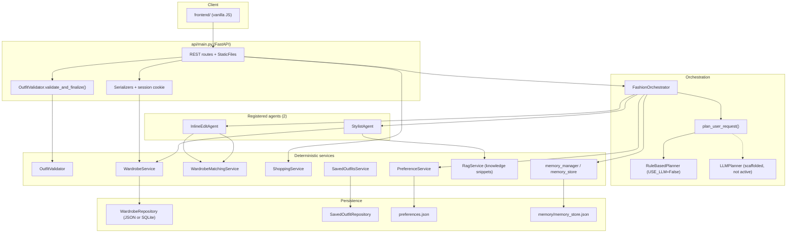
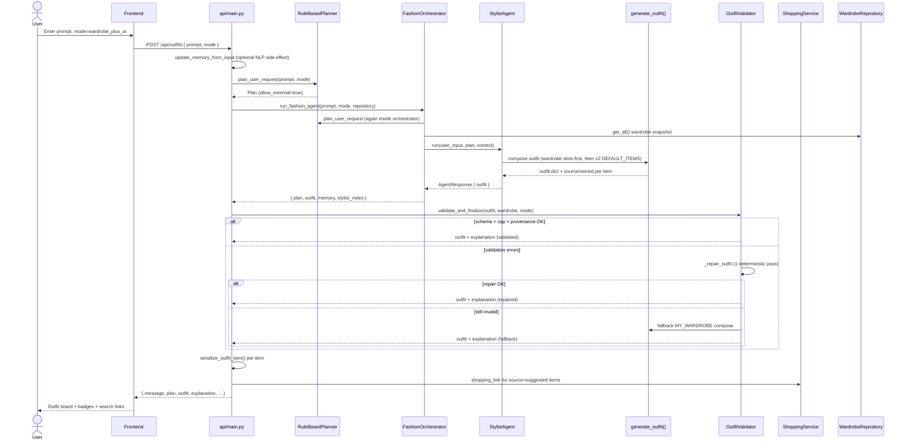

# StyleScout — Architecture

> Reviewer-facing overview. For development process rules see `AGENTS.md`; for decision history see `docs/DECISIONS.md`.

StyleScout is a **deterministic-first** outfit assistant: a vanilla JS frontend talks to a FastAPI backend that composes outfits from a user's wardrobe (or a small catalogue fallback), validates every response through a single gate, and attaches marketplace **search deep-links** — never scraped inventory or fake prices.

---

## Component diagram

**Notes (current code, not aspirational):**

- Only **StylistAgent** and **InlineEditAgent** are registered on the orchestrator (SCOUT-011). Memory, wardrobe CRUD, shopping, and preferences are **services**, not agents.
- **`USE_LLM = False`** in `agents/planner.py` — production uses **RuleBasedPlanner** only. `LLMPlanner` is a keyword mock scaffold; `services/llm_client.py` (OpenRouter) is **not** called from the request path.
- **`OutfitValidator`** runs on **`POST /api/outfits` only** (after `run_fashion_agent`, before serialization). Inline edit does **not** pass through the gate (known gap — see DECISIONS).
- **Three styling modes** (`my_wardrobe`, `wardrobe_plus_ai`, `ai_inspiration`) are applied via `Plan.apply_styling_mode()` and enforced at compose time in `StylistAgent.generate_outfit()` plus again in the validation gate.

---

## Sequence: `wardrobe_plus_ai` outfit request

Mode 2 exercises hybrid composition (wardrobe + ≤2 suggested items), the validation gate's **suggested cap**, and the **repair → fallback** path when validation fails.

---

## Deterministic vs LLM boundary

| Step | Today (production path) | LLM-capable (not active) |
|------|-------------------------|---------------------------|
| Intent / plan extraction | **RuleBasedPlanner** keyword rules → `Plan` | `LLMPlanner` scaffold (`USE_LLM=False`) |
| Outfit composition | **Rule-based composer** in `StylistAgent.generate_outfit()` | Would route through LLM if planner/agent swapped |
| Mode policy | **Deterministic** `Plan.apply_styling_mode()` + compose branches | Same contract; LLM would not bypass gate |
| Ownership (Mode 3) | **`resolve_inspiration_ownership()`** name/id matching | N/A |
| Validation | **`OutfitValidator`** Pydantic schema + mode constraints + repair/fallback | Repair regen calls same deterministic composer |
| Inline edit | **Keyword rules** (`inline_edit_config.py`) + wardrobe matching | InlineEditAgent has no LLM call today |
| Stylist notes | **RagService** retrieves static knowledge snippets | Labels say "RULE-BASED COMPOSER" when `USE_LLM=False` |
| Shopping links | **`ShoppingService`** builds Vinted **search URLs** from `SearchSpec` | No product API |
| OpenRouter client | **`services/llm_client.py` exists but unused** in HTTP path | Would need explicit wiring + `USE_LLM=True` |

**Bottom line:** 100% of live `POST /api/outfits` traffic is deterministic today. The LLM hooks are intentional scaffolding, not hidden production behavior.

---

## Three styling modes (compose + gate)

| Mode | API value | Compose policy | Gate checks |
|------|-----------|----------------|-------------|
| **My wardrobe** | `my_wardrobe` | Wardrobe items only; missing categories omitted | Every item `source=wardrobe`, `owned=true`, must exist in snapshot |
| **Wardrobe + AI** | `wardrobe_plus_ai` | Wardrobe first; max **2** suggested catalogue items | Provenance fields + suggested cap ≤2 |
| **AI inspiration** | `ai_inspiration` | Catalogue compose without wardrobe context; then **`resolve_inspiration_ownership()`** marks matches owned | Provenance must match wardrobe identity set |

Suggested catalogue pieces use stable `sug_*` ids when unowned; matched wardrobe rows keep persisted `itm_*` ids (SCOUT-015 follow-up).
